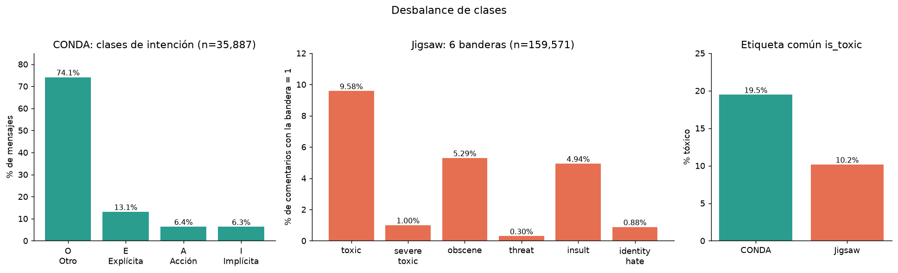
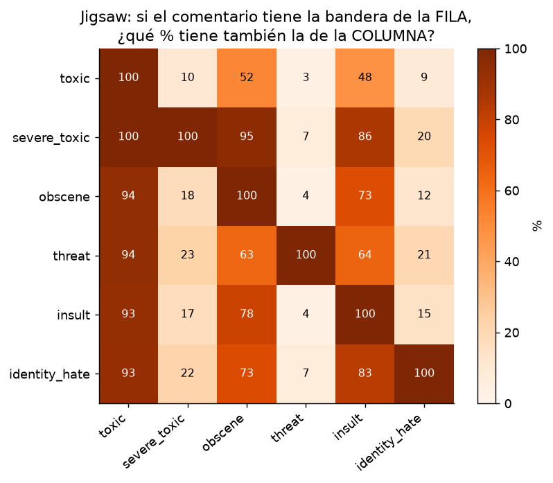
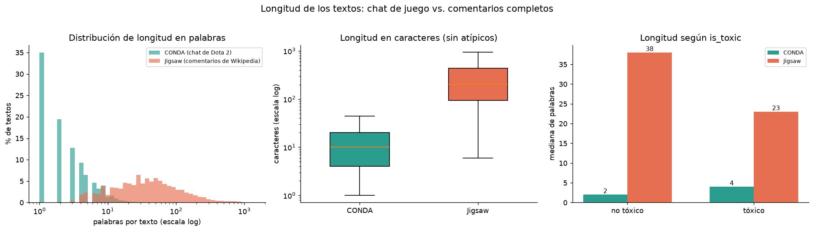
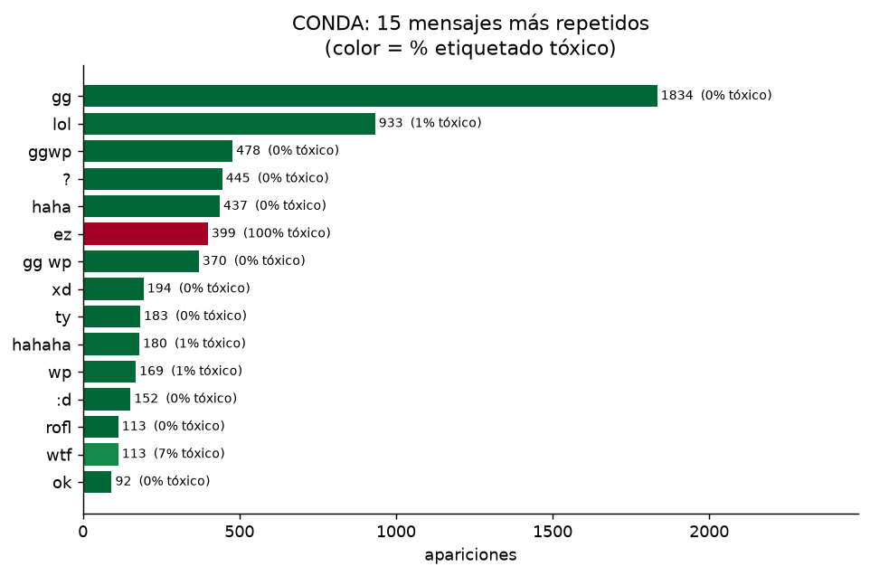
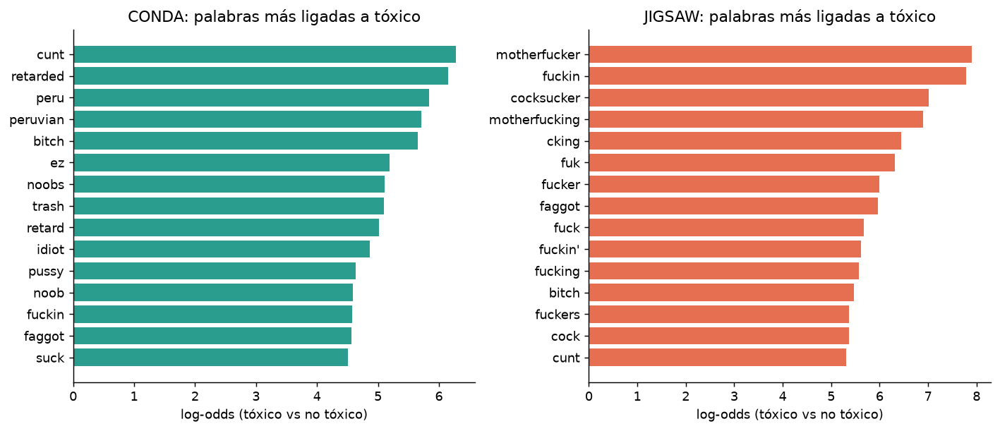

# Apartado exploratorio del conjunto de datos

Análisis sobre `Unificado/dataset_unificado.csv.gz` (195,458 textos: 35,887 de CONDA y 159,571 de Jigsaw).
Se reproduce con `python Proyecto/Conjunto_de_Datos/exploratorio.py`. Todas las tablas están en `estadisticas.md`.

Las etiquetas y la limpieza están explicadas en `../DECISIONES.md`.

## Resumen

1. **Las clases están desbalanceadas en los dos datasets**, y Jigsaw más que CONDA.
2. **Los textos de las dos fuentes son de naturaleza muy distinta**: la mediana es de 2 palabras en CONDA y 36 en Jigsaw.
3. **La longitud se relaciona con la toxicidad en sentido opuesto en cada fuente.** En CONDA los tóxicos son más largos; en Jigsaw son más cortos.
4. **El 37% de las filas de CONDA tienen un texto repetido** (`gg`, `lol`, `ez`...). Sus etiquetas son bastante consistentes: solo 136 filas contradicen a las demás con el mismo texto.
5. **Unir las fuentes tiene un riesgo de sesgo**: un modelo podría aprender a distinguir la fuente, no la toxicidad.

---

## 1. Desbalance de clases

**CONDA** (4 clases): `O` domina con 74.1%. Después vienen `E` 13.1%, `A` 6.4% e `I` 6.3%.
Con la etiqueta común, 19.5% es tóxico (razón no tóxico : tóxico de 4.1 : 1).

**Jigsaw** (6 banderas): solo `toxic` (9.6%), `obscene` (5.3%) e `insult` (4.9%) superan el 4%. Las más raras son `threat` (478 comentarios, 0.30%), `identity_hate` (0.88%) y `severe_toxic` (1.00%).
Con la etiqueta común, 10.2% es tóxico (razón de 8.8 : 1).

**Qué implica**
- Un clasificador que prediga siempre "no tóxico" acertaría 80.5% en CONDA y 89.8% en Jigsaw. La exactitud (*accuracy*) no sirve como métrica. Conviene usar F1, precisión/recall por clase o PR-AUC.
- `threat` tiene tan pocos ejemplos que cualquier modelo multietiqueta de Jigsaw tendrá problemas con ella.
- Si se trabaja con las 4 clases de CONDA, `A` e `I` tienen alrededor de 2,300 ejemplos cada una. Es poco, pero es manejable.

### Las banderas de Jigsaw están muy ligadas entre sí

- `toxic` aparece en más del 92% de los comentarios que tienen cualquier otra bandera.
- `severe_toxic` siempre implica `toxic`, y el 95% de los `severe_toxic` también son `obscene`.
- El 60.8% de los comentarios tóxicos tiene 2 o más banderas.

Las 6 banderas no son independientes, así que tratarlas como 6 problemas separados desperdicia esa información.

## 2. Longitud de los textos

| | CONDA | Jigsaw |
|---|---|---|
| Mediana de palabras | 2 | 36 |
| Mediana de caracteres | 10 | 204 |
| Percentil 99 (palabras) | 16 | 567 |
| Textos de una sola palabra | 35.0% | 0.01% |

Los dos datasets casi no se traslapan en longitud. La mayoría de los textos de CONDA son de una o dos palabras (`gg`, `lol`, `?`), y casi todos los de Jigsaw tienen varias oraciones.

**La relación con la toxicidad va en sentido contrario:**

| Mediana de palabras | no tóxico | tóxico |
|---|---|---|
| CONDA | 2 | 4 |
| Jigsaw | 38 | 23 |

Una explicación probable, que **no verifiqué**: en CONDA los tóxicos son más largos porque insultar necesita más que un `gg`; en Jigsaw son más cortos porque el vocabulario más ligado a no tóxico es técnico (ver sección 4), y esos comentarios suelen ser largos.

**Qué implica**
- La longitud sola sirve como señal en cada fuente, pero **en direcciones opuestas**. Un modelo único entrenado con ambas puede mezclar esa señal.
- Hay que tener cuidado con la tokenización y el truncado: 37 comentarios de Jigsaw llegan al tope de 5,000 caracteres, y el 99% de CONDA cabe en 75 caracteres.

## 3. CONDA: mucho texto repetido

- Hay 23,951 textos distintos entre 35,887 mensajes. Los 15 más repetidos suman 17% del dataset, y 37.3% de las filas tiene un texto que aparece más de una vez.
- `gg`, `lol`, `ggwp`, `haha`, `gg wp` y `wp` son casi siempre no tóxicos. `ez` aparece 399 veces y se etiqueta tóxico en el 99.7%.
- `wtf` (113 veces) es tóxico en el 7.1% de los casos, así que la etiqueta depende del contexto.
- **Contradicciones reales.** Solo 84 textos distintos de CONDA aparecen con etiquetas tóxico y no tóxico a la vez. Esos 84 textos suman 5,259 filas (la columna `is_conflict_text` marca todas), pero las filas que discrepan de la etiqueta mayoritaria son solo **136**, y en 64 de los 84 textos es una sola fila. Los más discutidos son `fuck` (15 de 26 tóxicos), `wtf` (8 de 113), `lol` (7 de 933) y `easy` (6 de 17). En Jigsaw hay 27 filas marcadas.

**Qué implica**
- Las etiquetas de CONDA son bastante consistentes para el mismo texto. La contradicción es poca, pero se concentra en palabras ambiguas (`fuck`, `wtf`, `easy`), donde el contexto decide.
- Un modelo que solo vea el texto del mensaje aprende `ez` = tóxico, pero no puede distinguir bien esos casos ambiguos. Esto conecta con el objetivo de la pre-propuesta (no bloquear palabras casuales en el juego). El contexto de conversación (`conversationId`, `chatTime`) está en los CSV originales de CONDA. El archivo unificado solo conserva `matchId` (en `group_id`).

## 4. Vocabulario más asociado a cada clase

- **Insultos directos** (`cunt`, `bitch`, `retard(ed)`, `faggot`, `idiot`) aparecen entre los más ligados a tóxico en ambas fuentes.
- **Específicos de CONDA:** `ez`, `noob(s)` y `trash` (jerga de juego usada como insulto). Destacan también `peru` y `peruvian` (41 y 36 textos tóxicos, ninguno no tóxico): el paper de CONDA da "Peruvians" como ejemplo de lenguaje racista. Un modelo podría aprender "Perú" como señal de toxicidad.
- **Específicos de Jigsaw:** variantes ortográficas de groserías (`fuk`, `fuckin'`, `cking`).
- **Lo más ligado a no tóxico** en Jigsaw es vocabulario técnico de Wikipedia (`dropdown`, `cellpadding`, `specifies`, `licensing`, `tutorial`). En CONDA son frases de cortesía del juego (`glhf`, `ggwp`, `ty`, `sec`).

## 5. Riesgos de unir las dos fuentes

Estos puntos salen de las secciones anteriores. Son riesgos, no resultados de un modelo: no entrené nada.

1. **La fuente predice parcialmente la etiqueta.** CONDA es 19.5% tóxico y Jigsaw 10.2%, y los textos de una y otra son tan distintos en longitud y vocabulario que identificar la fuente es trivial. Un modelo podría usar eso en vez de la toxicidad. Conviene reportar métricas **por fuente**, no solo agregadas.
2. **"Tóxico" no es la misma cosa en las dos fuentes.** Jigsaw incluye `obscene` como tóxico, y en CONDA una grosería sin objetivo es `O` (no tóxico). Esto afecta justo el caso de uso del proyecto.
3. **Fuga de datos en CONDA.** El split oficial comparte partidas y conversaciones entre train y valid (ver `DECISIONES.md`). Las métricas sobre valid serán optimistas si no se re-divide por `group_id`.
4. **Ruido propio de cada fuente.** Jigsaw tiene marcado de wiki (`cellpadding`) y fragmentos como `cking`; CONDA tiene fórmulas repetidas que dominan el vocabulario.

## 6. Qué decidir con estos resultados

- **Métrica de evaluación:** F1 o PR-AUC por fuente y por clase, no exactitud.
- **Qué hacer con los repetidos de CONDA:** conservarlos (reflejan el chat real) o limitar cuántas veces entra cada texto para que `gg` no pese 1,834 veces. Las contradicciones de etiqueta son pocas (136 filas), así que no obligan a eliminar nada.
- **Si el modelo es uno solo o dos separados** (uno por fuente), dado que longitud y estilo son tan distintos.
- **Si se re-divide CONDA por partida** antes de entrenar.
