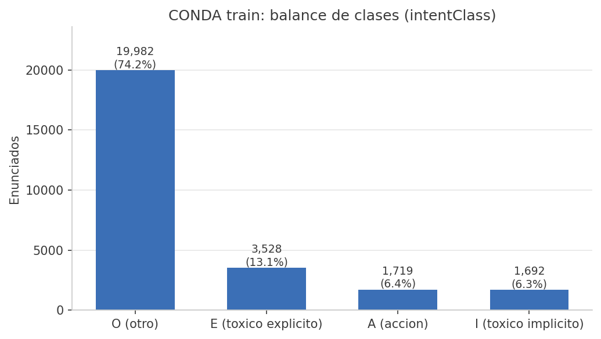
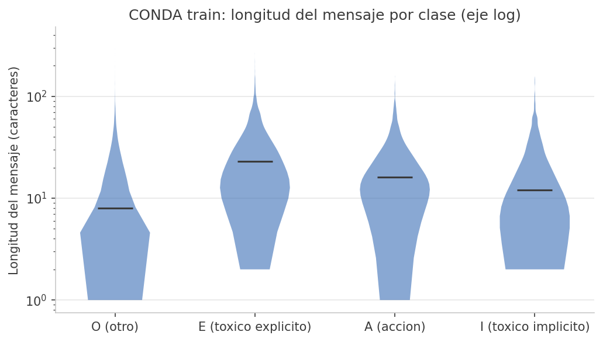
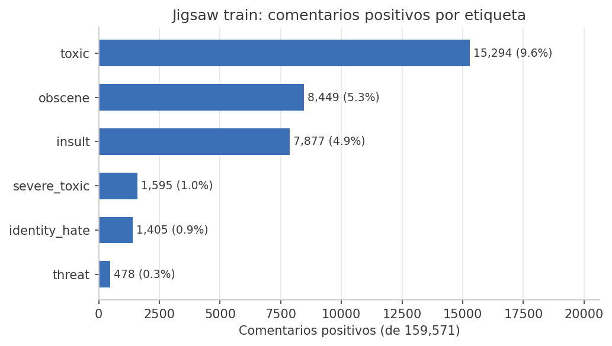
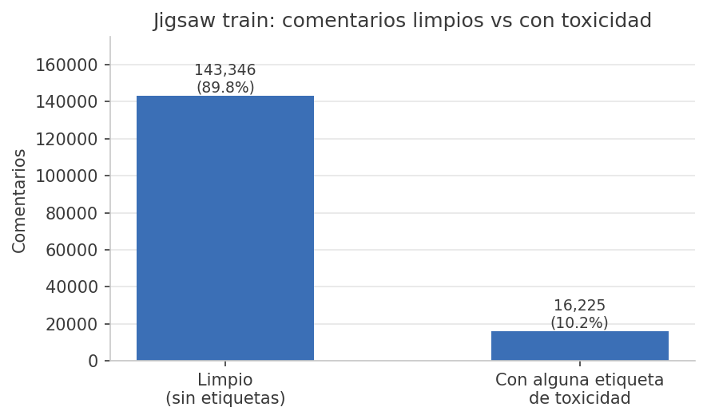
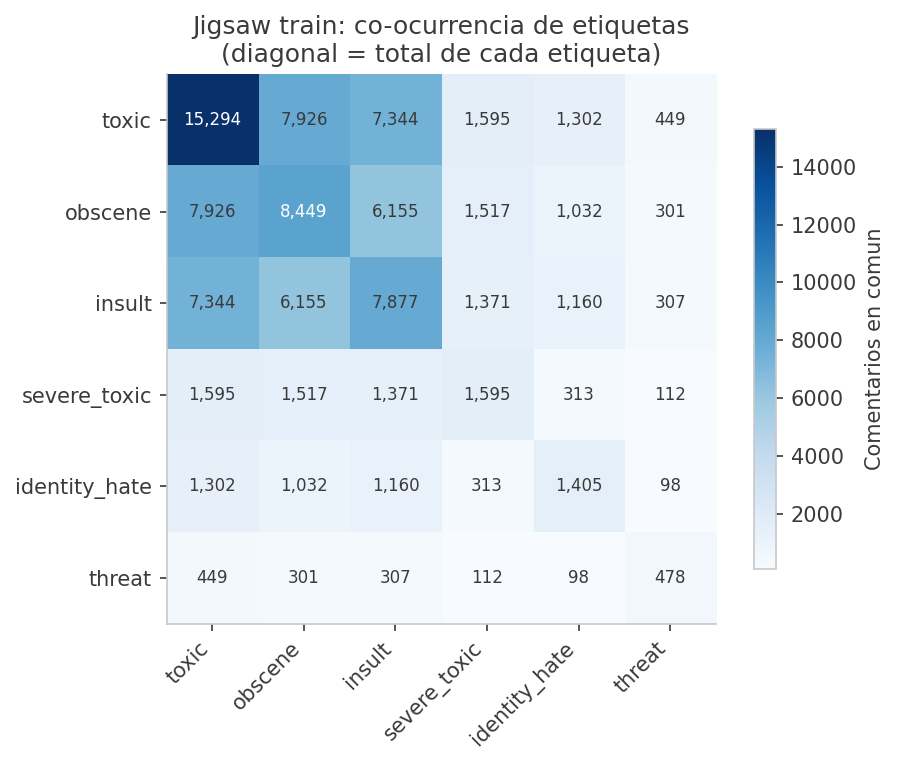

# Bitácora de datos, entrada 02: exploración inicial (sobre v0)

Antes de limpiar o modelar hay que mirar los datos. Esta entrada recorre cinco
figuras generadas sobre los archivos v0, tal como se descargaron. Para
reproducirlas (o regenerarlas después sobre su v1) corran desde la raíz del
repositorio:

```bash
python3 Proyecto/Herramientas/eda_inicial.py
```

El script imprime en pantalla los números exactos y deja las imágenes en
`Proyecto/Documentacion/figuras/`. Cada figura viene con una lectura corta y
una pregunta. Las preguntas no son retóricas: son el tipo de cosa que deben
poder responder en la propuesta.

## Figura 1. Balance de clases en CONDA



En el train de CONDA, 74.2% de los enunciados son clase O (otro), 13.1% son
tóxicos explícitos (E), 6.4% son acciones (A) y 6.3% tóxicos implícitos (I).
Es decir, tres de cada cuatro mensajes no son tóxicos, y la clase que más nos
interesa detectar con matices, la toxicidad implícita, es la más chica.

Pregunta: si un modelo contesta siempre "O", acierta 74% de las veces. ¿Qué
métrica van a reportar para que ese modelo trivial no parezca bueno, y qué
harán con el desbalance durante el entrenamiento?

## Figura 2. Longitud del mensaje por clase en CONDA



El eje vertical está en escala logarítmica porque unos cuantos mensajes largos
aplastarían el resto. La mediana global es de 11 caracteres (media 17.6), o
sea, dos o tres palabras. Por clase hay diferencias: los mensajes O tienen
mediana de 8 caracteres, los I de 12, los A de 16 y los E de 23. La toxicidad
explícita tiende a venir en mensajes más largos; la implícita ("ez" después de
ganar) puede caber en dos letras.

Pregunta: con mensajes de 11 caracteres de mediana, ¿qué tan lejos llega una
representación de bolsa de palabras o TF-IDF por mensaje aislado? ¿Qué técnica
de las que han visto aprovecharía que `conversationId` permite leer los
mensajes vecinos?

## Figura 3. Conteo de las seis etiquetas de Jigsaw



De 159,571 comentarios, `toxic` aparece en 15,294 (9.6%), `obscene` en 8,449
(5.3%) e `insult` en 7,877 (4.9%). Las otras tres son rarísimas: `severe_toxic`
1.0%, `identity_hate` 0.9% y `threat` 0.3%. Con 478 positivos de `threat`, un
split descuidado puede dejar decenas de ejemplos en el conjunto de prueba.

Pregunta: ¿tiene sentido intentar predecir las seis etiquetas, o para su
objetivo conviene colapsarlas en un problema binario tóxico contra no tóxico?
¿Qué se gana y qué se pierde en cada caso?

## Figura 4. Comentarios limpios contra tóxicos en Jigsaw



El 89.8% de los comentarios (143,346) no tiene ninguna etiqueta de toxicidad;
solo el 10.2% (16,225) tiene al menos una. El desbalance es todavía más fuerte
que en CONDA, y además los comentarios de Wikipedia son largos: mediana de 205
caracteres contra 11 de CONDA, casi veinte veces más texto por ejemplo.

Pregunta: si quisieran usar Jigsaw para apoyar un modelo que al final se
evalúa sobre chat de videojuegos, ¿qué problemas anticipan por esa diferencia
de longitud y de vocabulario, y cómo los medirían?

## Figura 5. Co-ocurrencia de etiquetas en Jigsaw



La diagonal repite el total de cada etiqueta; las demás celdas cuentan
comentarios que tienen ambas. Las etiquetas se traslapan mucho: de los 8,449
comentarios `obscene`, 7,926 son también `toxic` (94%), y de los 1,595
`severe_toxic` todos son `toxic` por construcción. Las seis etiquetas no son
categorías separadas sino capas sobre el mismo fenómeno.

Pregunta: dado este traslape, ¿las seis etiquetas aportan seis problemas
distintos o son en buena parte redundantes? ¿Cómo influiría eso en su decisión
de la figura 3?

## Lo que la exploración todavía no responde

Este recorrido usa los datos crudos y deja fuera cosas que van a saltar en
cuanto limpien: mensajes repetidos, texto en otros idiomas, ortografía de chat
("u", "plz", "gggg"), y el marcador `[SEPA]` de CONDA que une mensajes
consecutivos. Nada de eso está resuelto aquí a propósito.

## Lo que sigue y les toca a ustedes

- Elegir el dataset principal con base en lo que muestran estas figuras y
  justificarlo por escrito en la propuesta.
- Definir la limpieza de texto (v1), aplicarla, volver a correr
  `eda_inicial.py` sobre los archivos limpios y documentar en una entrada
  nueva de esta bitácora qué cambió respecto a estas figuras.
- Llenar la matriz de revisión con los cinco PDFs de
  `Articulos/Revision/Fuentes/`; fíjense en qué dataset y qué métricas usa
  cada artículo, porque eso les da contra qué compararse.
- Aterrizar la propuesta a un objetivo único de detección de toxicidad. La
  presencia de otros idiomas en el chat es un asunto de limpieza o de
  alcance, no un segundo objetivo de detección de idioma.
